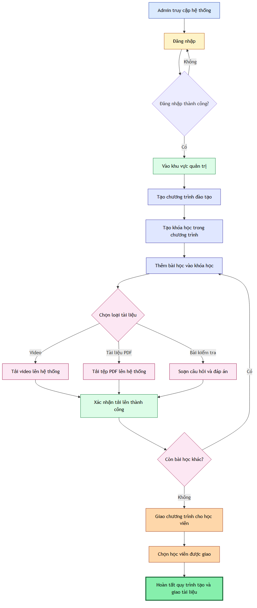
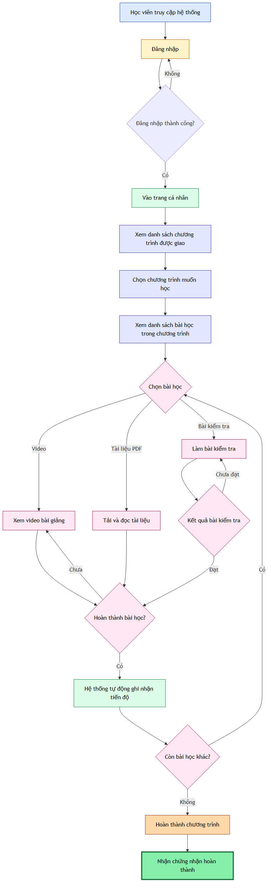
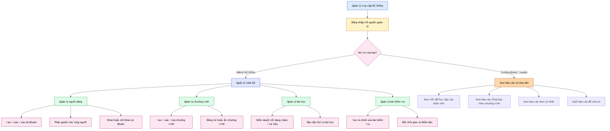

# BÁO CÁO LUỒNG HOẠT ĐỘNG HỆ THỐNG

**Hệ thống đào tạo EPath** — Báo cáo mô tả nghiệp vụ
**Ngày tạo:** 18/07/2026

---

## Mục lục

1. [Tổng quan hệ thống](#1-tổng-quan-hệ-thống)
2. [Quy trình tạo và giao tài liệu](#2-quy-trình-tạo-và-giao-tài-liệu)
3. [Quy trình học viên xem tài liệu](#3-quy-trình-học-viên-xem-tài-liệu)
4. [Quy trình quản lý hệ thống](#4-quy-trình-quản-lý-hệ-thống)

---

## 1. Tổng quan hệ thống

Hệ thống ePath là nền tảng đào tạo nội bộ giúp doanh nghiệp số hoá quá trình đào tạo nhân viên. Hệ thống phục vụ ba nhóm người dùng chính:

- **Quản trị viên (Admin):** tạo và quản lý nội dung đào tạo, quản lý tài khoản người dùng.
- **Học viên (User):** truy cập chương trình được giao, xem video, đọc tài liệu, làm bài kiểm tra.
- **Quản lý / Lãnh đạo (Leader):** theo dõi tiến độ học tập của nhân viên, xem báo cáo tổng hợp.

Mọi tài liệu sau khi được Admin đăng tải sẽ được lưu trữ tập trung và phân phối theo phân quyền. Hệ thống tự động ghi nhận quá trình học của từng học viên để phục vụ báo cáo.

---

## 2. Quy trình tạo và giao tài liệu

Quy trình do **Admin** thực hiện, bắt đầu từ việc tạo chương trình đào tạo, đến tải tài liệu lên hệ thống, và kết thúc bằng việc giao chương trình cho học viên cụ thể.

**Sơ đồ luồng:**

**Các bước chính:**

| Bước | Hành động | Mô tả chi tiết |
|------|-----------|----------------|
| 1 | Đăng nhập | Admin truy cập hệ thống bằng tài khoản được cấp. Nếu sai mật khẩu, hệ thống yêu cầu đăng nhập lại. |
| 2 | Tạo chương trình đào tạo | Đặt tên chương trình, mô tả nội dung, thiết lập thời hạn áp dụng. |
| 3 | Tạo khóa học | Mỗi chương trình có thể gồm nhiều khóa học khác nhau. |
| 4 | Thêm bài học | Thêm các bài học cho mỗi khóa học, chọn loại: video bài giảng, tài liệu PDF, hoặc bài kiểm tra. |
| 5 | Tải tệp lên | Video và PDF được đăng tải, hệ thống xác nhận tải lên thành công. |
| 6 | Soạn bài kiểm tra *(nếu có)* | Tạo câu hỏi, đáp án và thiết lập điểm đạt cho bài kiểm tra. |
| 7 | Giao chương trình | Chọn học viên hoặc nhóm học viên được phép truy cập chương trình. |

> Sau khi hoàn tất, học viên được giao sẽ nhìn thấy chương trình trong trang cá nhân của họ và có thể bắt đầu học ngay.

---

## 3. Quy trình học viên xem tài liệu

Quy trình do **Học viên** thực hiện — từ lúc đăng nhập đến khi hoàn thành chương trình và nhận chứng nhận.

**Sơ đồ luồng:**

**Các bước chính:**

| Bước | Hành động | Mô tả chi tiết |
|------|-----------|----------------|
| 1 | Đăng nhập | Học viên đăng nhập vào hệ thống bằng tài khoản cá nhân. |
| 2 | Xem danh sách | Vào trang cá nhân, xem danh sách các chương trình đào tạo được giao. |
| 3 | Chọn chương trình | Chọn chương trình muốn học, sau đó chọn bài học cụ thể trong chương trình. |
| 4 | Xem nội dung | Xem video bài giảng, tải và đọc tài liệu PDF, hoặc làm bài kiểm tra. |
| 5 | Ghi nhận tiến độ | Sau mỗi bài học, hệ thống tự động ghi nhận hoàn thành. Nếu chưa xem xong, học viên tiếp tục bài học. |
| 6 | Làm bài kiểm tra | Nếu có bài kiểm tra: làm bài, nộp bài và xem kết quả. Nếu chưa đạt, được phép làm lại. |
| 7 | Nhận chứng nhận | Hoàn thành tất cả bài học trong chương trình → nhận chứng nhận hoàn thành. |

> Mọi hoạt động xem tài liệu và làm bài kiểm tra đều được hệ thống ghi lại để phục vụ báo cáo cho lãnh đạo.

---

## 4. Quy trình quản lý hệ thống

Quy trình dành cho **Quản trị viên** (quản lý nội dung, người dùng) và **Lãnh đạo** (theo dõi báo cáo).

**Sơ đồ luồng:**

**Đối với Quản trị viên (Admin):**

| Chức năng | Các thao tác |
|-----------|-------------|
| **Quản lý người dùng** | Tạo tài khoản mới, phân quyền cho từng người, khoá hoặc mở khoá tài khoản. |
| **Quản lý chương trình** | Tạo, chỉnh sửa, ẩn hoặc xoá chương trình đào tạo. |
| **Quản lý bài học** | Kiểm duyệt nội dung video / tài liệu, sắp xếp thứ tự bài học. |
| **Quản lý bài kiểm tra** | Tạo và chỉnh sửa đề thi, đặt thời gian làm bài và điểm đạt. |

**Đối với Lãnh đạo (Leader):**

| Báo cáo | Mô tả |
|---------|--------|
| Tiến độ học tập | Xem tiến độ học tập của từng nhân viên theo thời gian thực. |
| Báo cáo theo chương trình | Xem báo cáo tổng hợp theo từng chương trình đào tạo. |
| Báo cáo theo cá nhân | Xem báo cáo chi tiết theo từng nhân viên cụ thể. |
| Xuất báo cáo | Xuất báo cáo ra file để chia sẻ với các bên liên quan. |

> Báo cáo được cập nhật theo thời gian thực, phản ánh đúng tiến độ học tập của từng học viên.

